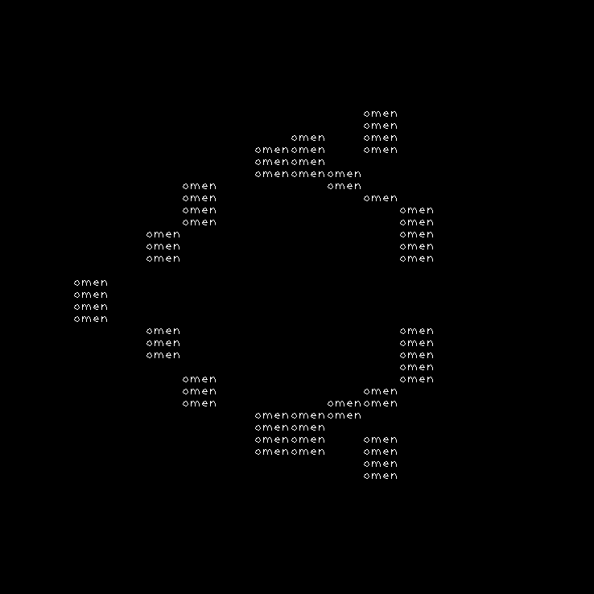

# charachterise
A small tool to convert your images filled with pixels into an image filled with charachters 

## What does that mean anyway?
See the 2 images below:

 

The first image was acquired from [here](https://design.ubuntu.com/downloads/) and the second image was obtained after transforming the first image via the `charachteriser`. The program simply took the charachter 'u' and placed it everywhere it could find a white region big enough to hold a 'u' charachter (which has unit font scale and has been created with lines of unit thickness of [Hershey Plain](https://codeyarns.com/tech/2015-03-11-fonts-in-opencv.html) type font in OpenCV).

So simply put, the following steps has been followed by `charachteriser` to generate the transformed image you see above:

1. Take an image and a string of charachters as input
2. Now sample only the white regions of the input image in such a way that the transformed image should look like as if someone has used the input string as the basic shape to redraw/write/represent the white regions of the image.

`charachteriser` has been made possible due to the existence of following tools:
* [OpenCV](https://opencv.org/) 4.4.0 
* [CMake](https://cmake.org/) 3.10.2
* [GNU Make](https://www.gnu.org/software/make/) 4.1
* [GCC](https://gcc.gnu.org/) 7.5.0

Using the above set of softwares, `charachteriser` has been tested on Ubuntu 18.04.03.
